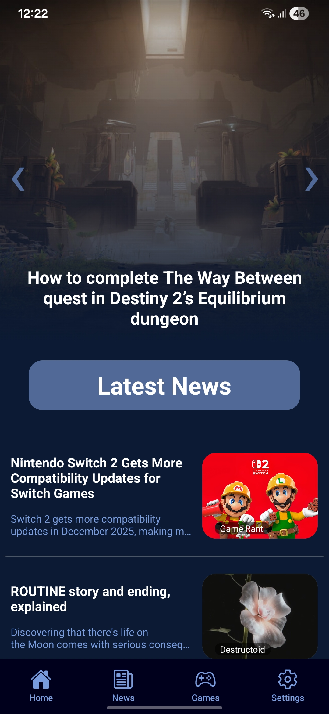
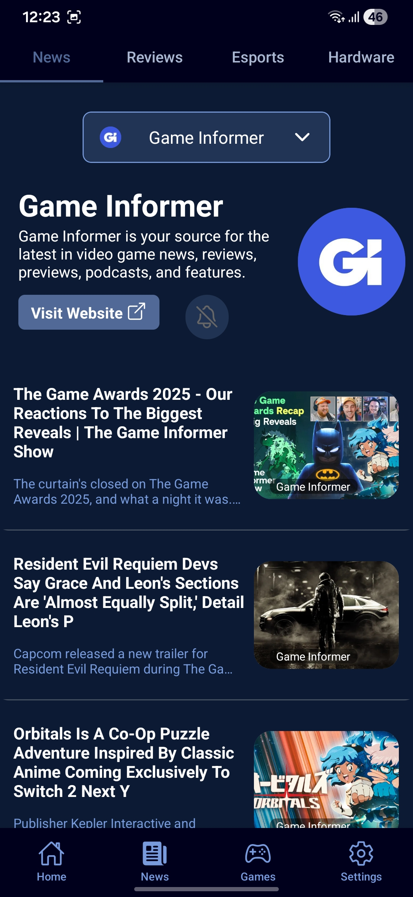
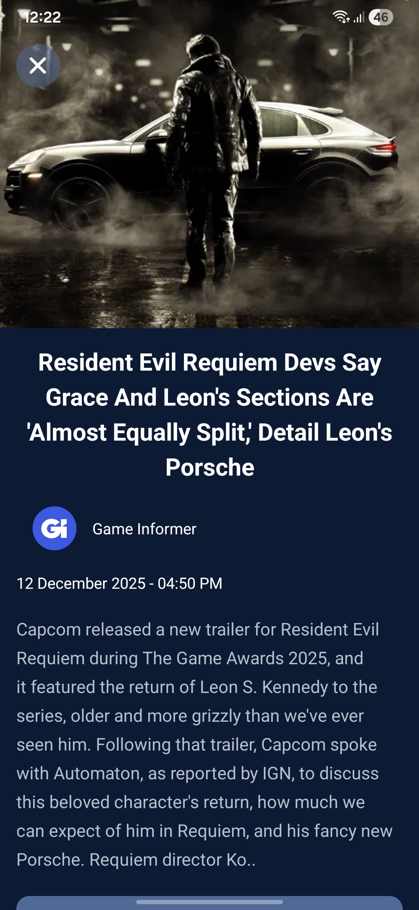
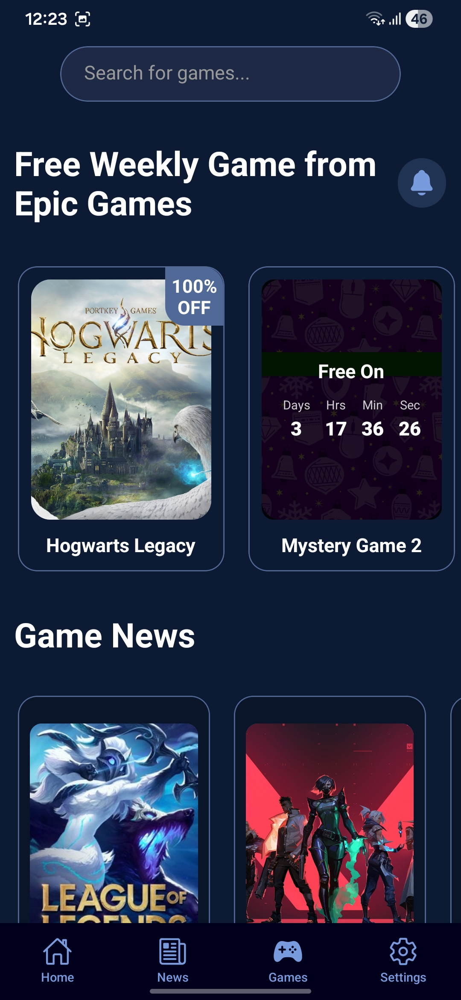
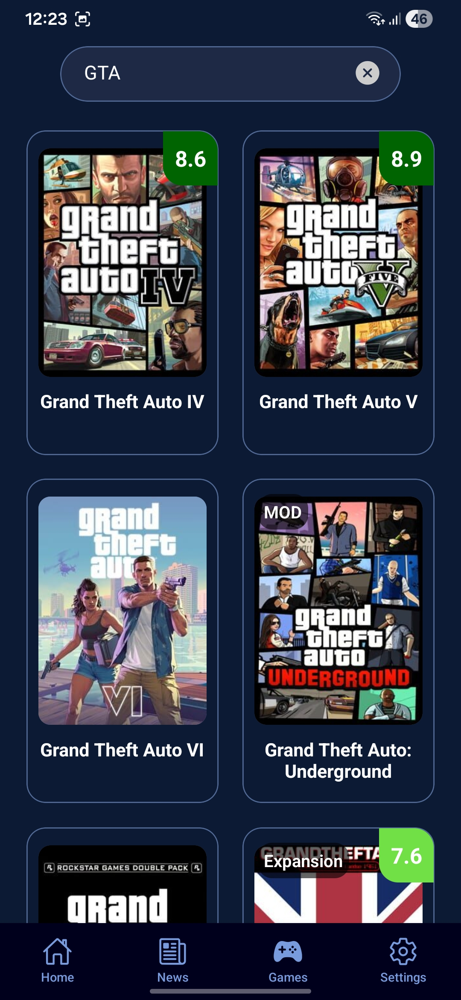
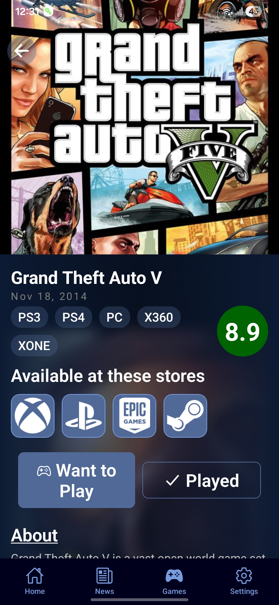
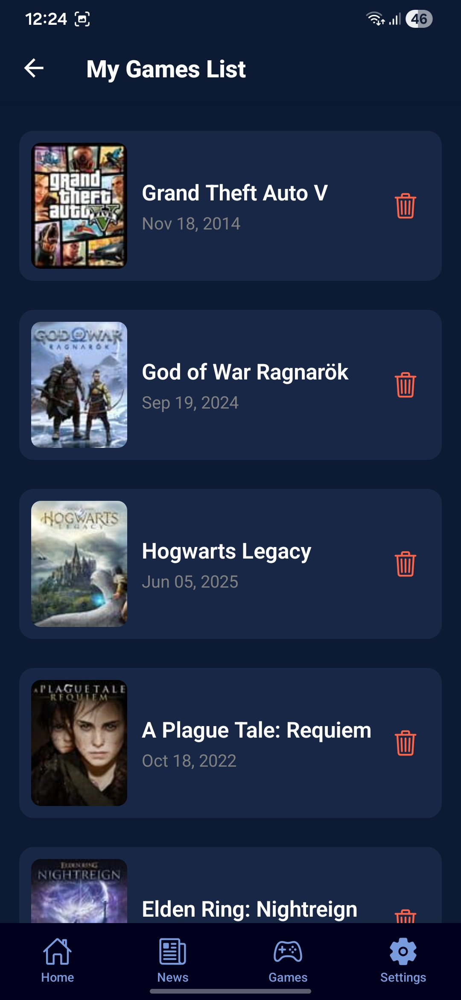
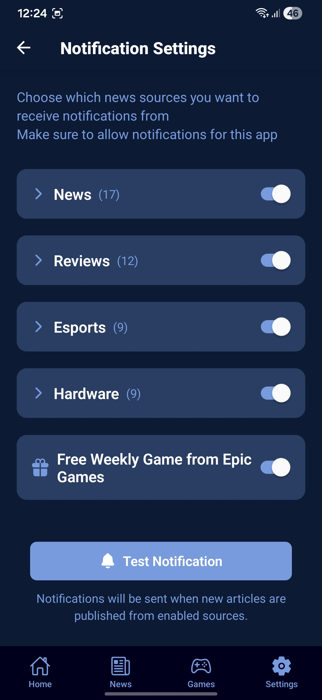

# 🎮 Gaming Zone App

**Gaming Zone** is a comprehensive mobile application designed for video game enthusiasts. Built with **React Native (Expo)**, it provides a seamless and modern experience for tracking the latest gaming news, reviews, and free game offers.

The app aggregates content from top sources, and allows users to manage their personal game library, powered by a robust backend using **Appwrite** and **Firebase**.

## ✨ Key Features

- **📰 Exclusive News & Reviews**: Stay updated with the latest articles, game reviews, hardware news, and Esports coverage from global and local sources (e.g., Destructoid, Arab Hardware).
- **🆓 Free Games Tracker**: Get instant alerts for free games available on major stores like Epic Games.
- **🔔 Smart Notifications**: Advanced Push Notifications system (FCM) to keep you informed about breaking news and limited-time offers.
- **🌍 Multi-language Support**: Full support for English and Arabic (RTL/LTR).
- **👤 User Profiles**: Create an account, sign in, and save your favorite games using secure authentication.
- **⚡ High Performance**: Optimized browsing experience with intelligent data caching.
- **🤖 Automated Content**: Automated scripts run periodically to fetch the latest news and game offers without manual intervention.

## 🛠️ Tech Stack

### Frontend

- **[React Native](https://reactnative.dev/)**: The core framework for building the mobile app.
- **[Expo](https://expo.dev/)**: For streamlined development and build management.
- **[React Navigation](https://reactnavigation.org/)**: For handling app navigation.
- **[TanStack Query (React Query)](https://tanstack.com/query/latest)**: For efficient state management and data caching.

### Backend & Services

- **[Appwrite](https://appwrite.io/)**: Serves as the primary database for storing articles and game data.
- **[Firebase](https://firebase.google.com/)**:
  - **Authentication**: Manages user sign-ups and logins.
  - **Cloud Messaging (FCM)**: Handles push notifications.
  - **Analytics**: Tracks user engagement and app performance.
- **GitHub Actions**: Runs cron jobs (e.g., `free-games.yml`) to execute fetching scripts periodically.

## 🚀 Getting Started

Follow these instructions to get the project up and running on your local machine.

### Prerequisites

- [Node.js](https://nodejs.org/) (LTS version recommended).
- Firebase and Appwrite accounts for backend service configuration.

### Installation

1.  **Clone the repository**:

    ```bash
    git clone [https://github.com/youssefhany1/gamingzoneapp.git](https://github.com/youssefhany1/gamingzoneapp.git)
    cd gamingzoneapp
    ```

2.  **Install dependencies**:

    ```bash
    npm install
    # or
    yarn install
    ```

3.  **Environment Setup**:
    Create a `.env` file in the root directory and add your project keys (refer to `app.config.js` or `eas.json` for required variables):

    ```env
    APPWRITE_ENDPOINT=[https://cloud.appwrite.io/v1](https://cloud.appwrite.io/v1)
    APPWRITE_PROJECT=your_project_id
    APPWRITE_DATABASE_ID=your_database_id
    APPWRITE_API_KEY=your_api_key
    ```

4.  **Run the App**:
    ```bash
    npx expo start
    ```
    Scan the QR code with your phone (using Expo Go) or run on an emulator.

## ⚙️ Automation

The project includes automation scripts located in the `scripts/` folder:

- `fetchFreeGames.cjs`: Fetches the latest free games.
- `fetchRss.cjs`: Aggregates news from RSS feeds.

These are triggered automatically via **GitHub Actions** to ensure the Appwrite database is always up-to-date.

## 📸 Screenshots

<p align="center">
  
  
  
</p>
<p align="center">
  
  
  
</p>
<p align="center">
  
  
</p>

## 🤝 Contributing

Contributions are welcome! If you have suggestions for improvements or find any bugs:

1.  Open an **Issue** to discuss the change.
2.  Submit a **Pull Request** with your enhancements.

---

**Developed by [Youssef Hany](https://github.com/youssefhany1)**
